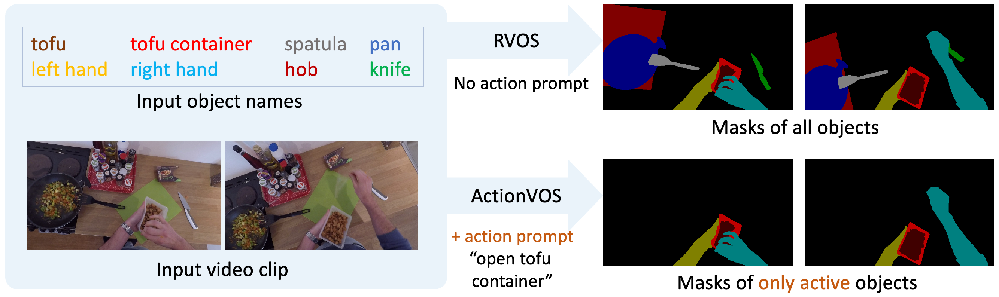
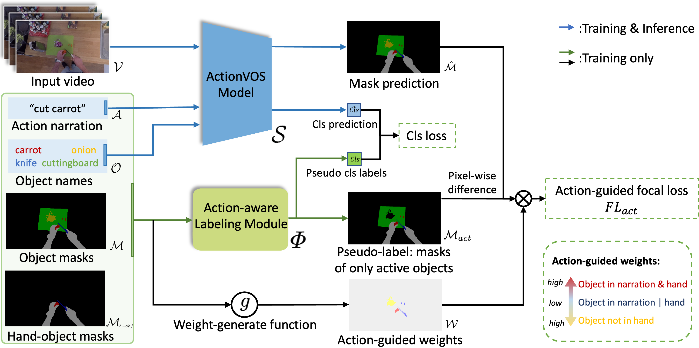
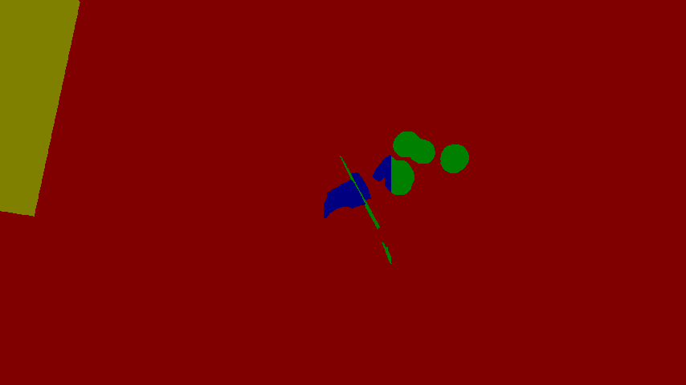

**ActionVOS: Actions as Prompts for Video Object Segmentation**

Our [paper](https://arxiv.org/abs/2407.07402) is accepted by **ECCV-2024** as [**oral**](https://eccv.ecva.net/virtual/2024/oral/1604) presentation! 

<div align=center>   </div>

**Picture:**  *Overview of the proposed ActionVOS setting*

<div align=center>   </div>

**Picture:**  *The proposed method in our paper.*

---

This repository contains the official PyTorch implementation of the following paper:

> **ActionVOS: Actions as Prompts for Video Object Segmentation**<br>
Liangyang Ouyang, Ruicong Liu, Yifei Huang, Ryosuke Furuta, and Yoichi Sato<br> <!-- >  https://arxiv.org/abs/  -->
> 
>**Abstract:**  
Delving into the realm of egocentric vision, the advancement of referring video object segmentation (RVOS) stands as pivotal in understanding human activities. However, existing RVOS task primarily relies on static attributes such as object names to segment target objects, posing challenges in distinguishing target objects from background objects and in identifying objects undergoing state changes. To address these problems, this work proposes a novel action-aware RVOS setting called ActionVOS, aiming at segmenting only active objects in egocentric videos using human actions as a key language prompt. This is because human actions precisely describe the behavior of humans, thereby helping to identify the objects truly involved in the interaction and to understand possible state changes. We also build a method tailored to work under this specific setting. Specifically, we develop an action-aware labeling module with an efficient action-guided focal loss. Such designs enable ActionVOS model to prioritize active objects with existing readily-available annotations. Experimental results on VISOR dataset reveal that ActionVOS significantly reduces the mis-segmentation of inactive objects, confirming that actions help the ActionVOS model understand objects' involvement. Further evaluations on VOST and VSCOS datasets show that the novel ActionVOS setting enhances segmentation performance when encountering challenging circumstances involving object state changes.

## Resources

Material related to our paper is available via the following links:

- [**Paper**](https://arxiv.org/abs/2407.07402)
- [**Video**](https://youtu.be/dt-zDQKzq1I)
- [VISOR dataset](https://epic-kitchens.github.io/VISOR/)
- [VOST dataset](https://www.vostdataset.org/data.html)
- [VSCOS dataset](https://github.com/venom12138/VSCOS)
- [ReferFormer Model](https://github.com/wjn922/ReferFormer)

## Requirements

* Our experiment is tested with Python 3.8, PyTorch 1.11.0. 
* Our experiment with RerferFormer used 4 V100 GPUs, and 6-12 hours for train 6 epochs on VISOR.
* Check **Training** instructions for necessary packages of RF.

## Playing with ActionVOS

### **Data preparation (Pseudo-labeling and Weight-generation)**

For the videos and masks, please download VISOR-VOS,VSCOS,VOST dataset from these links. We recommend to download VISOR-VOS first since we use VISOR-VOS for both training and testing.

- [**VISOR-VOS (28.4GB)**](https://data.bris.ac.uk/data/dataset/2v6cgv1x04ol22qp9rm9x2j6a7)
- [VSCOS (20GB)](https://github.com/venom12138/VSCOS)
- [VOST (50GB)](https://www.vostdataset.org/data.html)

[Action narration annotations](./annotations/EPIC_100_train.csv) are obtained from [EK-100](https://github.com/epic-kitchens/epic-kitchens-100-annotations). (We already put them in this repository so you don't need to download it.)

[Hand-object annotations](./annotations/visor_hos_train.json) are obtained from [VISOR-HOS](https://github.com/epic-kitchens/VISOR-HOS). (Please download from google drive [link1](https://drive.google.com/file/d/1Op-QtoweJ-2M0nuMqtbBHAsJ4Ep-g6nU/view?usp=sharing), [link2](https://drive.google.com/file/d/1KkQ-BOC4E0P087D2hyTN9eUxMmNPq_Ot/view?usp=sharing) and put them under /annotations.)

Then run data_prepare_visor.py to get data,annotation,action-aware pseudo-labels and action-guided weights for ActionVOS.

```
python data_prepare_visor.py --VISOR_PATH your_visor_epick_path
```

It takes 1-2 hours for processing data. After that, the folder dataset_visor will get structure of:

```
- dataset_visor
    - Annotations_Sparse
        - train
            - 00000001_xxx
              - obj_masks.png
            - 00000002_xxx
        - val      
    - JPEGImages_Sparse
        - train
            - 00000001_xxx
              - rgb_frames.jpg
            - 00000002_xxx
        - val
    - Weights_Sparse
        - train
            - 00000001_xxx
              - action-guided-weights.png
            - 00000002_xxx
        - val (not used)
    - ImageSets
        - train.json
        - val.json
        - val_human.json
        - val_novel.json
```

There are 2 special files val_human.json and val_novel.json. These files contains the split that used for results in our experiments, where val_human contains the actions annotated by human, val_novel contains actions that unseen in the validation set.

### **How to find action-aware pseudo labels**

Check [train.json](./dataset_visor/ImageSets/train.json). For each object name in each video, the json file contains a map such as {"name": "food container", "class_id": 21, "handbox": 0, "narration": 1, "positive": 1}. 

handbox = 1 for object mask intersects with hand-object bounding boxes. 

narration = 1 for object name mentioned in action narration. 

positive = 1 for pseudo positive object.

Note that object masks under Annotations_Sparse are for all objects. We combine them with class labels in experiments.

### **How to find action-guided weights**

Each picture under Weights_Sparse is an action-guided weight. 

<div align=center>   </div>

**Picture:**  *Action-guided Weights*

```
3 (yellow) for negative obj mask.
2 (green) for hand | narration obj mask. 
4 (blue) for hand & narration obj mask.
1 (red) for other areas
```

### **Training**

ActionVOS is an action-aware setting for RVOS, and any RVOS model with an extra class head can be trained for ActionVOS. In our experiments, we take ReferFormer-ResNet101 as the base RVOS model.

Clone [ReferFormer](https://github.com/wjn922/ReferFormer) repository and download their [pretrained checkpoints](https://connecthkuhk-my.sharepoint.com/:u:/g/personal/wjn922_connect_hku_hk/EShgDd650nBBsfoNEiUbybcB84Ma5NydxOucISeCrZmzHw?e=YOSszd).
```
git clone https://github.com/wjn922/ReferFormer.git
cd ReferFormer
mkdir pretrained_weights
download from the link
```

Install the necessary packages for ReferFormer.

```
cd ReferFormer
pip install -r requirements.txt 
pip install 'git+https://github.com/facebookresearch/fvcore' 
pip install -U 'git+https://github.com/cocodataset/cocoapi.git#subdirectory=PythonAPI'
cd models/ops
python setup.py build install
```

Put modificated files to ReferFormer folders.

```
python copy_rf_actionvos_files.py
```

Run training scripts. If you want to change training configs, check [RF_ActionVOS/configs.md](RF_ActionVOS/configs.md). The following example shows training actionvos on a single GPU 0.

```
cd ReferFormer
bash scripts/train_actionvos.sh actionvos_dirs/r101 pretrained_weights/r101_refytvos_joint.pth 1 0 29500 --backbone resnet101 --expression_file train_meta_expressions_promptaction.json --use_weights --actionvos_path ../dataset_visor --epochs 6 --lr_drop 3 5 --save_interval 3
```

After the training process, the weights will be saved to actionvos_dirs/r101/checkpoint.pth.

### **Inference**

For quick start to ActionVOS models, we offer a trained RF-R101 checkpoint in [this link](https://drive.google.com/file/d/140gfK4GkI5iBSVFqoi_CAfL6d0J39nOW/view?usp=sharing).

#### **Inference on VISOR**

```
cd ReferFormer
bash scripts/test_actionvos.sh actionvos_dirs/r101 pretrained_weights/actionvos_rf_r101.pth 0 29500 --backbone resnet101 --expression_file val_meta_expressions_promptaction.json --use_positive_cls --pos_cls_thres 0.75 --actionvos_path ../dataset_visor
```

The output masks will be saved in ReferFormer/actionvos_dirs/r101/val.

#### **Inference on your own videos and prompts**

Change your videos and prompts into a actionvos_path like

```
- demo_path    
    - JPEGImages_Sparse
        - val
            - video_name
              - rgb_frames.jpg
    - ImageSets
        - expression_file.json
```

Check the [example json file](demo_path/ImageSets/expression_file.json) for the prompt formats.

```
cd ReferFormer
bash scripts/test_actionvos.sh actionvos_dirs/demo pretrained_weights/actionvos_rf_r101.pth 0 29500 --backbone resnet101 --expression_file expression_file.json --use_positive_cls --pos_cls_thres 0.75 --actionvos_path ../demo_path
```

The output masks will be saved in ReferFormer/actionvos_dirs/demo/val.

## Citation

If this work or code is helpful in your research, please cite:

```latex
@article{ouyang2024actionvos,
  title={ActionVOS: Actions as Prompts for Video Object Segmentation},
  author={Ouyang, Liangyang and Liu, Ruicong and Huang, Yifei and Furuta, Ryosuke and Sato, Yoichi},
  journal={arXiv preprint arXiv:2407.07402},
  year={2024}
}
```

If you are using the data and annotations from [VISOR](https://proceedings.neurips.cc/paper_files/paper/2022/hash/590a7ebe0da1f262c80d0188f5c4c222-Abstract-Datasets_and_Benchmarks.html),[VSCOS](https://openaccess.thecvf.com/content/ICCV2023/html/Yu_Video_State-Changing_Object_Segmentation_ICCV_2023_paper.html),[VOST](https://openaccess.thecvf.com/content/CVPR2023/html/Tokmakov_Breaking_the_Object_in_Video_Object_Segmentation_CVPR_2023_paper.html), please cite their original paper.

If you are using the training and inference code, please cite [ReferFormer](https://openaccess.thecvf.com/content/CVPR2022/html/Wu_Language_As_Queries_for_Referring_Video_Object_Segmentation_CVPR_2022_paper.html).


## Contact

For any questions, including algorithms and datasets, feel free to contact me by email: `oyly(at)iis.u-tokyo.ac.jp`